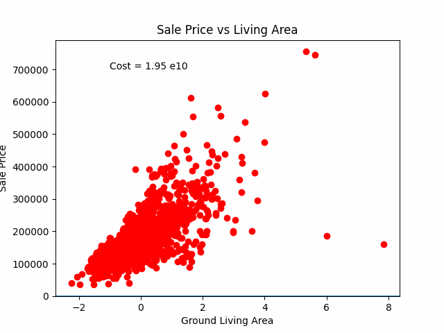

# Getting started

A simple implementation of Linear Regression.

# Disclaimer

* File `train.csv` is a simple version from [House Prices - Advanced Regression Technique](https://www.kaggle.com/competitions/house-prices-advanced-regression-techniques)

* Code sample in this repo is mainly from [Linear Regression from scratch (Gradient Descent)](https://www.kaggle.com/code/tentotheminus9/linear-regression-from-scratch-gradient-descent
)

# Python version
```shell
➜  ~ python3 --version
Python 3.12.9
➜  ~ pip3 --version
pip 25.0 from /usr/local/lib/python3.12/site-packages/pip (python 3.12)
```

# How to start
Create a virtual environment
```shell
python3 -m venv myenv
```

Activate the virtual environment
```shell
source myenv/bin/activate
```

Install Dependencies
```shell
pip3 install -r requirements.txt
```

Run
```shell
python3 main.py 
```

Deactivate the virtual environment
```shell
deactivate
```

Then open an `animation.gif` file.


